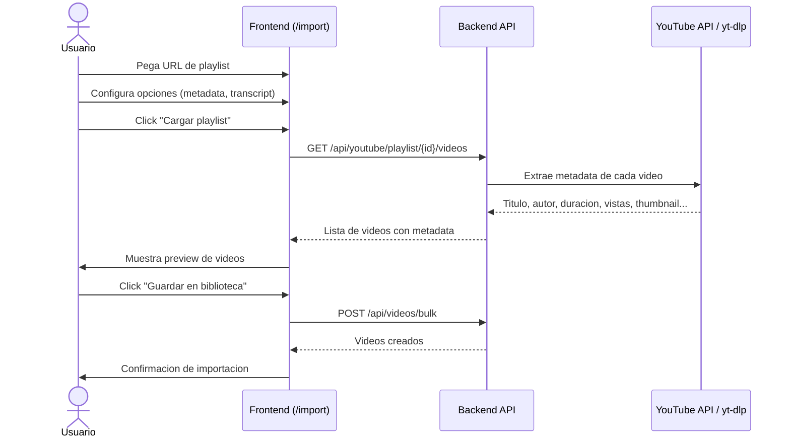
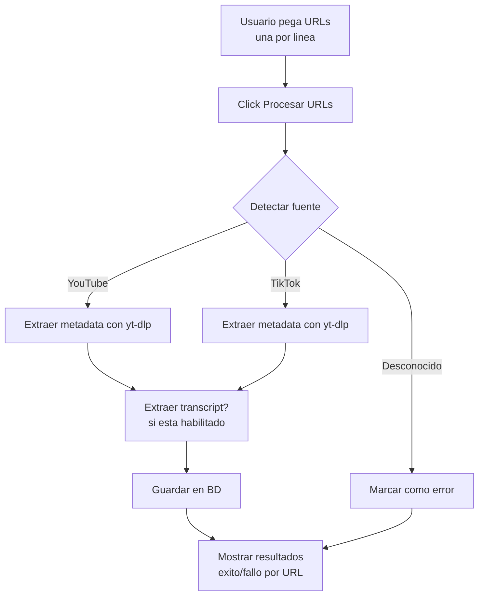
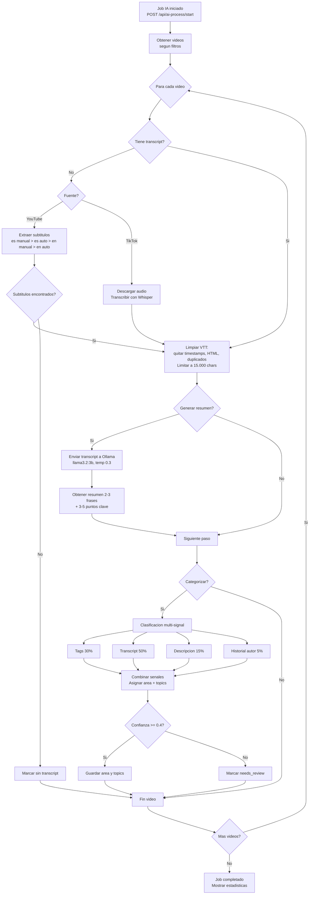
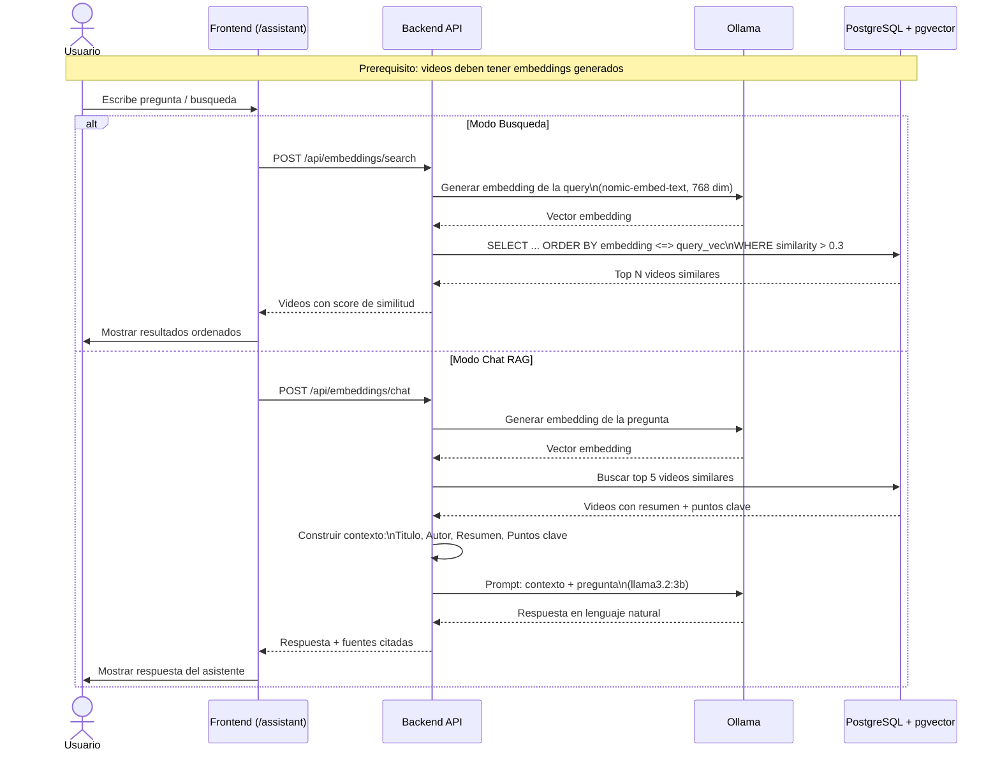
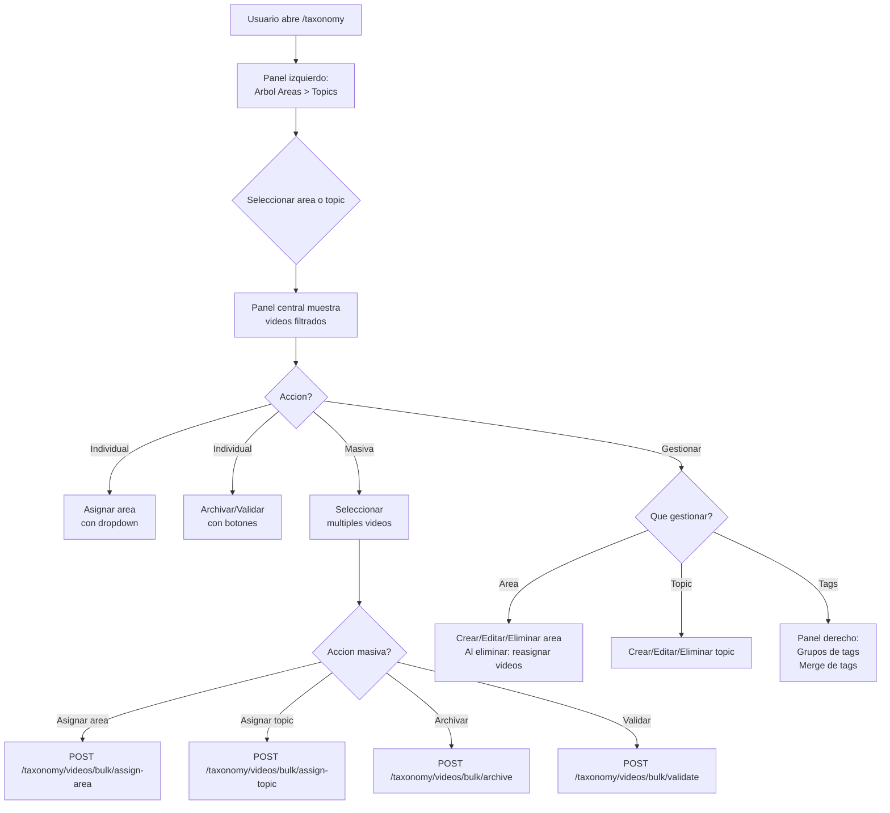
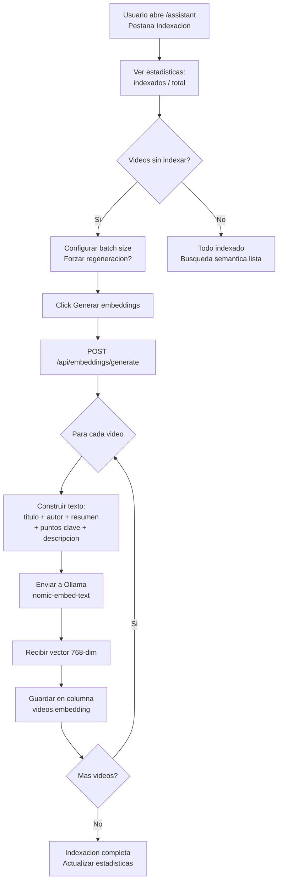
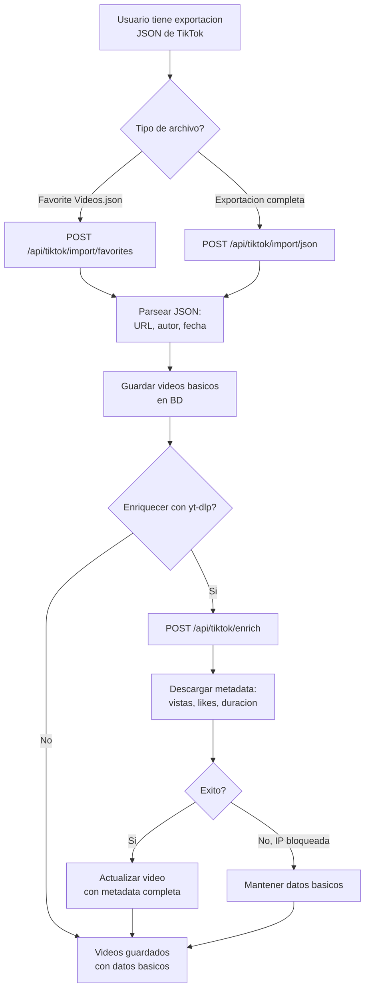

# Content Manager — Flujos de Negocio

## 1. Importacion de videos desde YouTube Playlist



## 2. Importacion de videos desde URLs en bulk



## 3. Procesamiento IA completo de un video



## 4. Busqueda semantica y Chat RAG



## 5. Gestion de taxonomia (clasificacion manual)



## 6. Gestion de canales curados

```mermaid
flowchart TD
    A[Usuario abre /channels] --> B{Accion?}
    
    B -->|Anadir canal| C[Pegar URL de YouTube]
    C --> D[Backend resuelve:\nnombre, thumbnail,\nsuscriptores, channel_id]
    D --> E[Configurar atributos:\ntema, nivel, energia,\ntipo uso, idioma]
    E --> F[Canal guardado]
    
    B -->|Importar videos| G[Seleccionar canal(es)]
    G --> H[Click Importar]
    H --> I[Backend extrae videos\nrecientes del canal]
    I --> J[Videos guardados\nen biblioteca]
    
    B -->|Configurar atributos| K[Gestionar temas,\nniveles, energias,\ntipos de uso]
    K --> L[CRUD con color,\norden y etiqueta]
    
    B -->|Exportar| M[GET /channels/export]
    M --> N[Descarga CSV\ncon todos los canales]
```

## 7. Generacion de embeddings e indexacion



## 8. Importacion TikTok



## Actores del sistema

| Actor | Descripcion |
|-------|-------------|
| **Usuario** | Sergio Porcar, unico usuario de la app |
| **Frontend** | App React corriendo en content.spcapps.com |
| **Backend** | FastAPI corriendo en Docker en VPS |
| **Ollama** | LLM local para categorizacion, resumen y chat |
| **Whisper** | Modelo local para transcripcion de audio |
| **YouTube API** | API oficial para OAuth y playlists |
| **yt-dlp** | Herramienta de scraping de video sin cuota |
| **PostgreSQL + pgvector** | BD relacional con extension de vectores |
